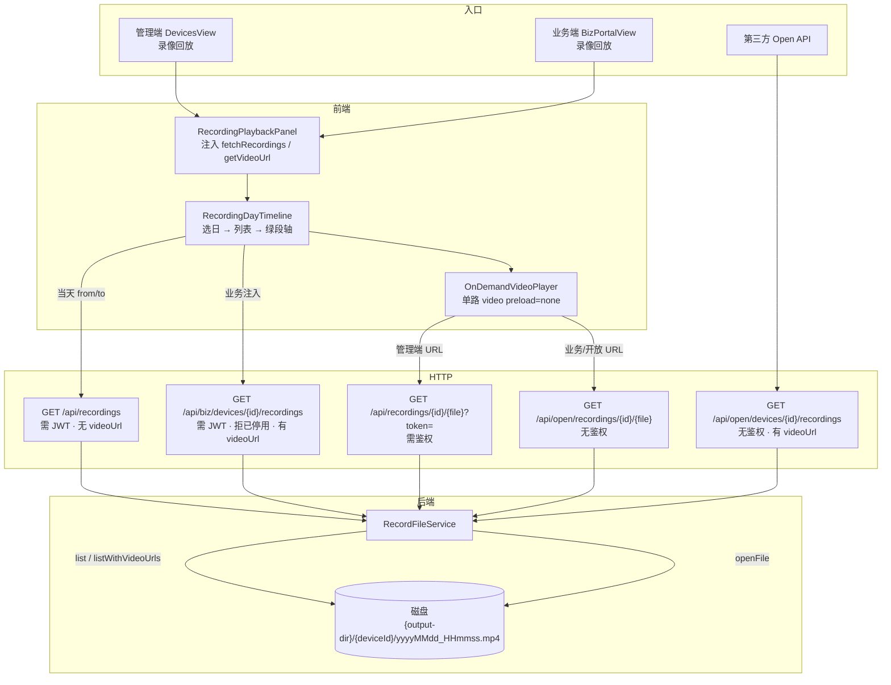
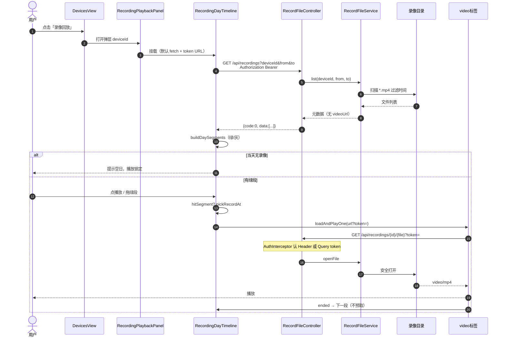
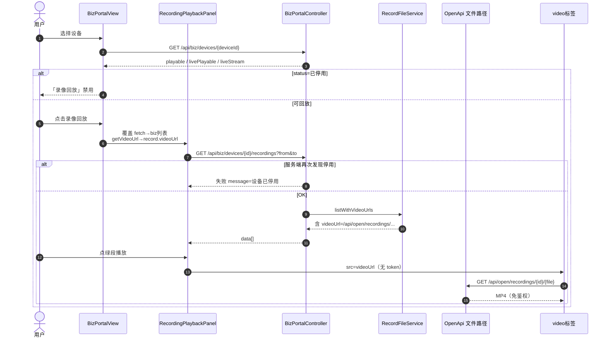
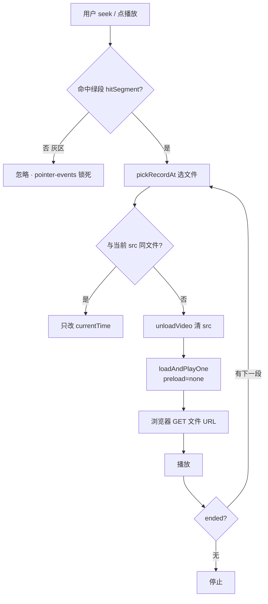
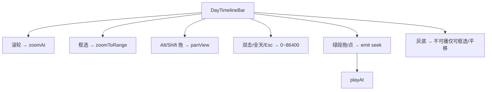

# 录像回放流程图（详细）

配套可视化 Canvas：Cursor 侧栏打开 `recording-playback-flow.canvas.tsx`。

---

## 1. 总览（三入口汇合）



---

## 2. 管理端时序



---

## 3. 业务端时序（含停用拦截）



---

## 4. 开放 API（第三方）

```mermaid
flowchart LR
  T[第三方系统] -->|1 列表| L["GET /api/open/devices/{deviceId}/recordings<br/>?from&to 可选"]
  L --> S[RecordFileService.listWithVideoUrls]
  S --> D[(落盘 MP4)]
  L -->|2 data[].videoUrl| T
  T -->|3 播放| F["GET /api/open/recordings/{deviceId}/{fileName}"]
  F --> S2[openFile]
  S2 --> D
```

---

## 5. 按需播放决策（前端核心）



---

## 6. 时间轴交互（不打列表接口）



**会打列表的时机：** 打开面板、换日期、点刷新。  
**会打文件的时机：** 换到新 MP4 播放。同文件 scrub 不发新请求。

---

## 7. 鉴权矩阵

| 接口 | 鉴权 | 播放侧用法 |
|------|------|------------|
| `GET /api/recordings` | Bearer | 管理端列表 |
| `GET /api/recordings/{id}/{file}` | Bearer 或 `?token=` | 管理端 `<video>` |
| `GET /api/biz/.../recordings` | Bearer | 业务端列表 |
| `GET /api/open/.../recordings` | 无 | 第三方列表 |
| `GET /api/open/recordings/{id}/{file}` | 无 | 业务/开放播放字节 |

---

## 8. 落盘与列表字段

```
{output-dir}/
  {deviceId}/
    20260915_143000.mp4   ← 文件名=段开始时间
```

列表项：`deviceId, fileName, timestamp, recordTime, size, path`；`listWithVideoUrls` 额外 `videoUrl`。  
无结束时间时前端用 `clipSeconds`（默认 300）推绿段终点。
